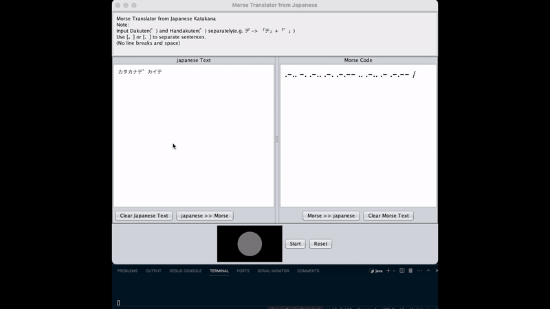

# Katakana to Morse Code Translator
Java GUI Application (Swing): Application that converts Japanese text to Morse code signals.

## Reference
[GitHub - SeunMatt/morsecodetranslator](https://github.com/SeunMatt/morsecodetranslator)

## Modifications
- Changed the translation from the alphabet to Japanese Katakana Morse signals.
- Enhanced the application to not only display text but also use a GUI to represent Morse signals through simulated light illumination.

## Overview

This Java application translates Japanese Katakana characters into Morse code and vice versa. It provides a graphical user interface (GUI) for users to input Katakana or Morse code and see the corresponding translation. Additionally, the application simulates a traffic light system to represent the Morse code visually.

## Features

- **Katakana to Morse Code Translation**: Users can input a string of Katakana characters, and the application will display the corresponding Morse code.
- **Morse Code to Katakana Translation**: Users can input Morse code, and the application will display the corresponding Katakana characters.
- **Graphical User Interface**: The application includes text areas for input and output, buttons for actions, and a traffic light simulation for Morse code.
- **Traffic Light Simulation**: The application simulates a traffic light that blinks red to represent the dots and dashes of Morse code visually.

## Components

- **Japanese Text Area**: A text area where users can input Katakana characters.
- **Morse Code Text Area**: A text area where users can input Morse code.
- **Translate Buttons**: Buttons to translate Katakana to Morse code and vice versa.
- **Clear Buttons**: Buttons to clear the respective text areas.
- **Traffic Light Panel**: A simulated traffic light that represents Morse code signals visually.

## Usage
1. **Execute the KatakanaTranslator.java.**: 

2. **Translating Katakana to Morse Code**: 
   - Enter Katakana characters in the Japanese text area.
   - Click the "Japanese >> Morse" button.
   - The Morse code representation will appear in the Morse code text area.
   - The traffic light will simulate the Morse code.

3. **Translating Morse Code to Katakana**: 
   - Enter Morse code in the Morse code text area.
   - Click the "Morse >> Japanese" button.
   - The Katakana representation will appear in the Japanese text area.

## Note

- Input Dakuten (゛) and Handakuten (゜) separately (e.g., デ -> 「テ」+「゛」).
- Use [。] or [、] to separate sentences in Katakana.
- The traffic light simulation visualizes Morse code, with red light for dots and dashes, pausing appropriately between characters and words.

